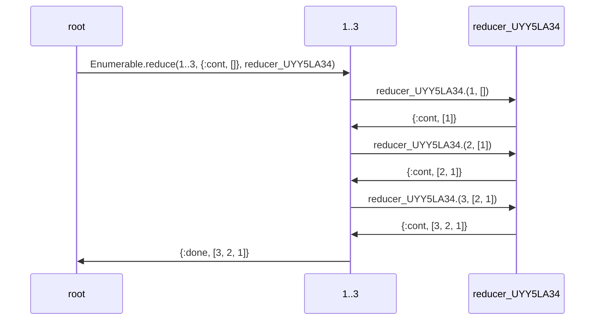
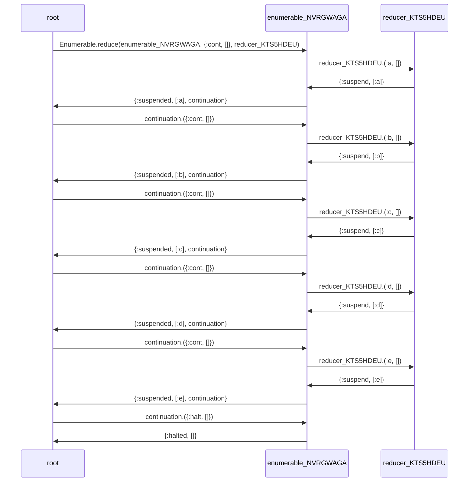

# EnumerableTracer

Builds Mermaid sequence diagrams showing what goes on under the hood for Elixir enumerables.

## Installation

EnumerableTracer is intended to be run in Livebook. It can be installed using [Mix.install/2](https://hexdocs.pm/mix/Mix.html#install/2).

```elixir
Mix.install([{:enumerable_tracer, github: "brettbeatty/elixir_enumerable_tracer"}])
```

## Usage

EnumerableTracer wraps enumerables in a stream that traces their implementation of `Enumerable`. These streams must be run in the function passed to `EnumerableTracer.run/2`, which renders a Mermaid diagram upon completion.

Any easy way to see the underlying enumerable iterated in its entirety is using `Enum.to_list/1`.

```elixir
enumerable = EnumerableTracer.trace(1..3, label: "1..3")

EnumerableTracer.run(fn ->
  Enum.to_list(enumerable)
end)
```



```
[1, 2, 3]
```

For both suspending and halting the enumerable, you can use `Enum.zip/2` to zip the enumerable with another, shorter one.

```elixir
enumerable = EnumerableTracer.trace([:a, :b, :c, :d, :e])

EnumerableTracer.run(fn ->
  Enum.zip(enumerable, 4..7)
end)
```



```
[a: 4, b: 5, c: 6, d: 7]
```

## Shortcomings

This is still very much in a hacked-together state.

It doesn't do anything to escape values rendered in Mermaid, so any inspected values with special characters for Mermaid could break the diagram. For example, any values that inspect with a "#" prefix will get cut off.

Also the names of reducers cannot be altered.
