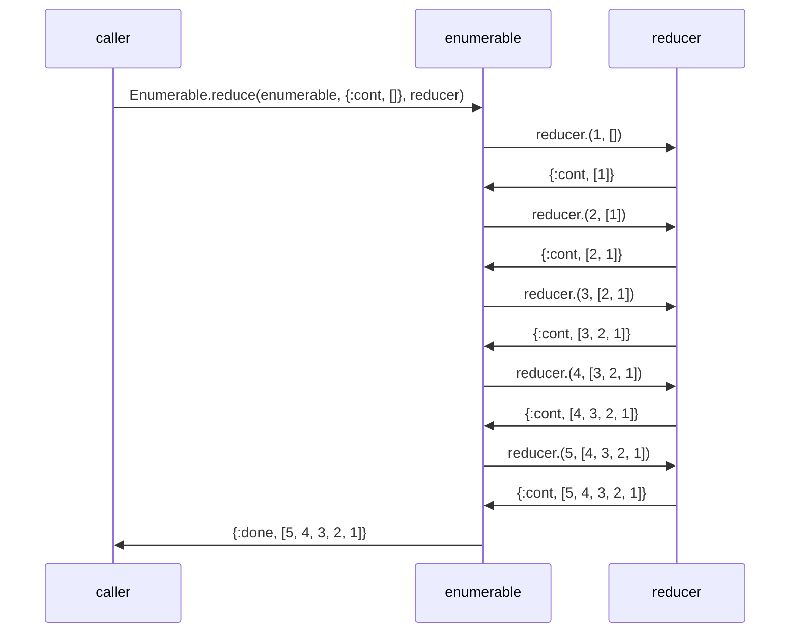
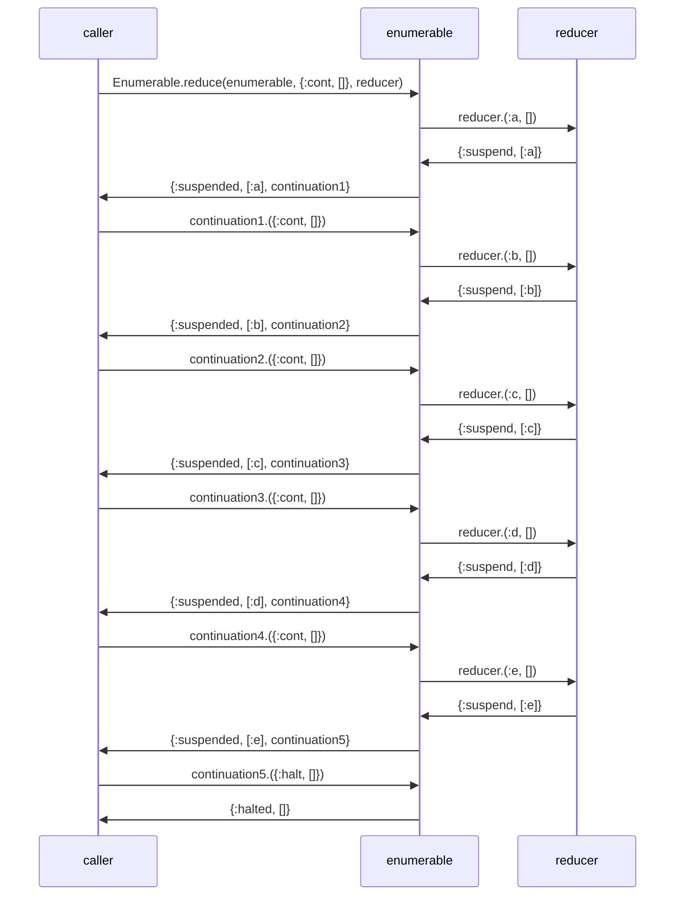

# EnumerableTracer

Builds Mermaid sequence diagrams showing what goes on under the hood for Elixir enumerables.

Not entirely clear picture because it forces use of [c:Enumerable.reduce/3](https://hexdocs.pm/elixir/Enumerable.html#reduce/3) even when enumerable is a list or implements another, more case-efficient Enumerable callback.

## Installation

EnumerableTracer is intended to be run in Livebook. It can be installed using [Mix.install/2](https://hexdocs.pm/mix/Mix.html#install/2).

```elixir
Mix.install([{:enumerable_tracer, github: "brettbeatty/elixir_enumerable_tracer"}])
```

## Usage

EnumerableTracer wraps enumerables in a stream that renders a Mermaid diagram using [Kino.render/1](https://hexdocs.pm/kino/Kino.html#render/1) upon completion.

This applies both when the underlying enumerable reaches its end and when it's halted early.

Any easy way to see the underlying enumerable iterated in its entirety is using `Enum.to_list/1`.

```elixir
1..5 |> EnumerableTracer.trace() |> Enum.to_list()
```



```
[1, 2, 3, 4, 5]
```

For both suspending and halting the enumerable, you can use `Enum.zip/2` to zip the enumerable with another, shorter one.

```elixir
[:a, :b, :c, :d, :e] |> EnumerableTracer.trace() |> Enum.zip(6..9)
```



```
[a: 6, b: 7, c: 8, d: 9]
```

## Shortcomings

This is just an MVP and has some serious flaws.

It doesn't do anything to escape values rendered in Mermaid, so any inspected values with special characters for Mermaid could break the diagram. For example, any values that inspect with a "#" prefix will get cut off.

Traces are also tied in a 1:1 relationship with enumerables. You can't have more than one enumerable in a trace. If you zip together two traced enumerables, for example, you'll see one diagram then another--they won't be intertwined. It could be interesting to have an async trace that sends trace messages to the process inbox and has an explicit gather/render function.

Also the names for the "participants" in the sequence diagram are static ("caller", "enumerable", and "reducer"). It could be interesting and probably fairly simple to let you pass in what to call each of them.
